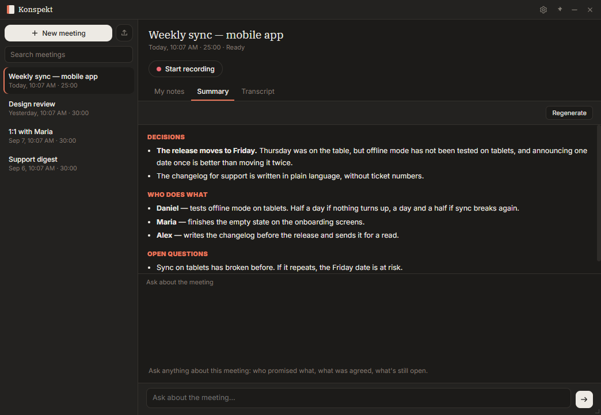

# Konspekt

A smart notepad for meetings — a local, privacy-first alternative to Granola.
Everything runs on your computer; nothing leaves your machine.
Always-on-top window, lives in the system tray.

**[Download for Windows](https://github.com/lamver/konspekt-releases/releases/latest)**
 · [Project page](https://lamver.github.io/konspekt/)



## What it does

- Captures audio from your microphone and system output (so you hear the other side in a call)
- Transcribes speech locally: Russian goes through GigaAM, everything else through Whisper
- Identifies speakers and remembers voices across meetings — name someone once, and they get labeled automatically from then on
- Turns the conversation into notes: decisions, who does what, and what is still open
- Answers questions about the meeting from the transcript
- Dictation: hold a hotkey anywhere in Windows, speak, and the text lands where your cursor is
- Imports pre-recorded files: drag and drop into the window, and each file becomes a meeting with its own transcript
- Speaks English, Spanish, Serbian and Russian; the language is picked in Settings → Appearance

Notes and answers are written by a language model. By default that model runs
locally too, so nothing leaves your machine — its weights are about 1.5 GB and
are downloaded the first time you ask for a summary, not bundled into the
installer. If you would rather use an OpenAI-compatible service of your own,
point Konspekt at it in Settings → Notes; that is the only case where anything
is sent anywhere.

## Getting started

Most people want the [installer](https://github.com/lamver/konspekt-releases/releases/latest).
The rest of this file is about running from source.

```bash
uv sync
uv run python -m app
```

Or double-click `konspekt.bat`.

This runs the development version straight from source with the latest changes.
It does not interfere with an installed copy: it uses its own data profile at
`%APPDATA%\Konspekt (razrabotka)`, with separate meetings, recordings, settings,
and model weights. Both copies can be open at the same time; the installed
version's meetings stay untouched.

You can tell them apart in the About dialog: the source version shows the
version number from `pyproject.toml`. The global hotkey goes to whichever copy
started first.

The profile name is set via the `KONSPEKT_PROFILE` environment variable, so you
can spin up as many copies as you like:

```bash
set KONSPEKT_PROFILE=experiment
uv run python -m app
```

Profile names must be in Latin script — they become folder and mutex names, and
the `.bat` file is read in a different code page where Cyrillic breaks.

Without the variable, the program uses the default user data directory, same as
the installed version. `KONSPEKT_DATA_DIR` overrides the path directly and takes
precedence over the profile; it exists for tests.

`uv run python -m app` shows logs in the console; `konspekt.bat` hides them.
Use the former when troubleshooting.

## Importing recordings

Drag files into the window in bulk, or click the arrow button next to "New
Meeting". The meeting title is taken from the file name.

Format detection is content-based, not extension-based: a file named `.txt`
will be parsed correctly if it contains mp3 audio, and a text file named `.mp3`
will be politely rejected. Anything ffmpeg understands works: mp3, wav, m4a,
ogg, opus, flac, and the audio track from video files.

If the recording has two channels with different voices (common in call
recordings), they are split into separate tracks. Ordinary stereo and music are
mixed down to mono.

## Keyboard shortcuts

| Shortcut       | Action                      |
|----------------|-----------------------------|
| `Ctrl+Shift+K` | Show / hide window (global) |
| `Ctrl+Shift+D` | Dictate into any app (global, off by default) |
| `Ctrl+N`       | New meeting                 |
| `Ctrl+R`       | Start / stop recording      |
| `Ctrl+S`       | Save notes                  |

Closing the window hides it to the tray rather than quitting the app.
Exit through the tray menu.

## Dictation

Off by default — it listens for a hotkey system-wide, and turning that on
without asking would be rude. Enable it in Settings → Dictation, where you can
also change the hotkey, choose between hold-to-talk and press-to-toggle, and
pick how the text is inserted (clipboard or typed character by character).

Nothing you dictate is stored: the audio lives in memory, never touches the
disk, and never appears in your meeting list. Dictation is unavailable while a
meeting is being recorded — there is one model and it cannot do both at once.

## Where data lives

```
%APPDATA%\Konspekt\
  konspekt.db       meetings, notes, transcripts
  settings.json     settings and window geometry
  konspekt.log      log
  audio/            meeting recordings
models/             model weights (next to the program)
```

Models are downloaded once on first use, about 560 MB total:
GigaAM for Russian (214), Whisper small for other languages (239),
language identifier (81), and voice fingerprints (25). The language model that
writes the notes is a separate ~1.5 GB download, fetched the first time you ask
for a summary.

## Status

Recording, transcription, speaker recognition, note synthesis, chat about a
meeting, imports and dictation all work; the interface is translated into four
languages. The current release is on the
[releases page](https://github.com/lamver/konspekt-releases/releases/latest),
what changed is in [CHANGELOG.md](CHANGELOG.md), and what comes next is in
[ROADMAP.md](ROADMAP.md).

## Tests

```bash
uv run python run_tests.py         # the fast suite, on every push
uv run python run_tests.py --full  # slow ones too: live audio, real models
uv run python run_tests.py --list  # what exists
```

Run them through `.venv\Scripts\python.exe` rather than the system Python: the
latter does not see all the libraries, and a dozen checks fail with "no such
module", which looks like broken code but is the wrong interpreter.

Tests that need live recordings look for them in the `audio_examples` folder.
It is not in the repository (12 MB of audio); without it those tests are skipped.

## License

Konspekt is distributed under [FSL-1.1-MIT](LICENSE.md): the source code is
open, you may freely use and modify it, with one restriction — you may not
package it into a competing commercial product. Each version becomes plain MIT
two years after release.

Third-party libraries bundled with the program, and what their licenses mean in
practice, are covered in [ЛИЦЕНЗИИ.md](ЛИЦЕНЗИИ.md) (in Russian). The short
version: the Russian speech model is MIT, ffmpeg inside PyAV is LGPL, and
nothing in the dependency tree is copyleft-infectious.
